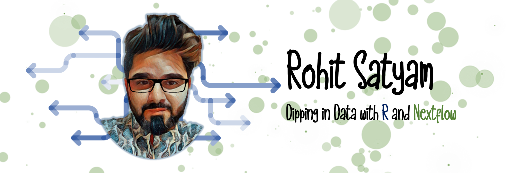

# Hi there 👋
I am a data analysis enthusiast and Bioinformatician at King Abdullah University of Science and Technology, Saudi Arabia. I handle all sorts of Genomics Data Analysis, Data Visualisation and reproducile research needs of my group. 

**Status:** Currently married to science until I find something more physical 🏳️‍🌈 

- 🌈 Pronouns: He/Him  
- 💻 Coding: Bash, R, Python (Basic), Shiny, Nextflow  
- 🚴‍♀️ Hobbies: Singing,   

# Let's Connect!
---
 [![alt text][1.1]][1]  &nbsp; [![alt text][2.1]][2] &nbsp; [![alt text][3.1]][3]&nbsp; [![alt text][4.1]][4]
 

<!-- social icons-->

[1.1]: https://github.com/gauravghongde/social-icons/blob/master/PNG/Black/Twitter_black.png =25x25
[2.1]: https://github.com/gauravghongde/social-icons/blob/master/PNG/Black/LinkedIN_black.png
[3.1]: https://github.com/gauravghongde/social-icons/blob/master/PNG/Black/Github_black.png
[4.1]: https://github.com/gauravghongde/social-icons/blob/master/PNG/Black/Medium_black.png

<!-- links to social-->
[1]: https://twitter.com/RohitSatyam1
[2]: https://www.linkedin.com/in/rohit-satyam-705617117/
[3]: https://github.com/Rohit-Satyam/
[4]: https://medium.com/@rohitsatyam
